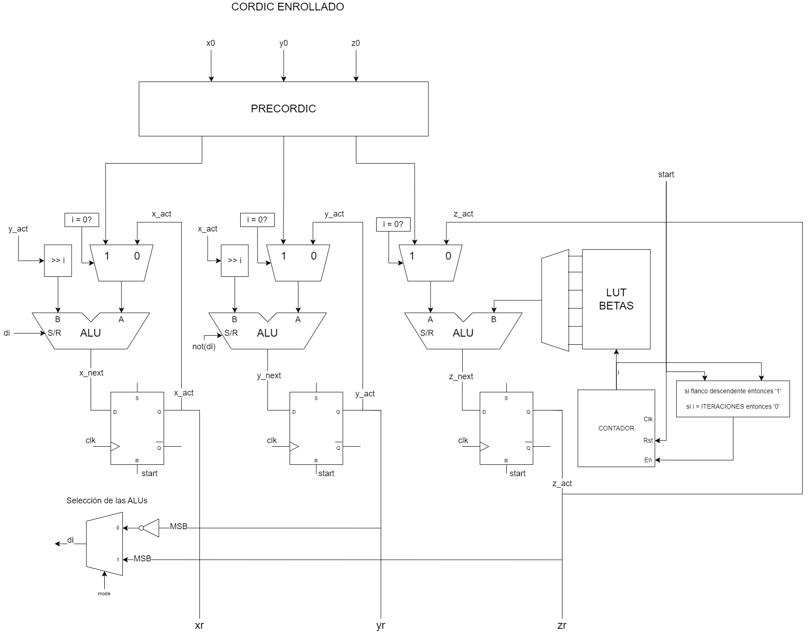
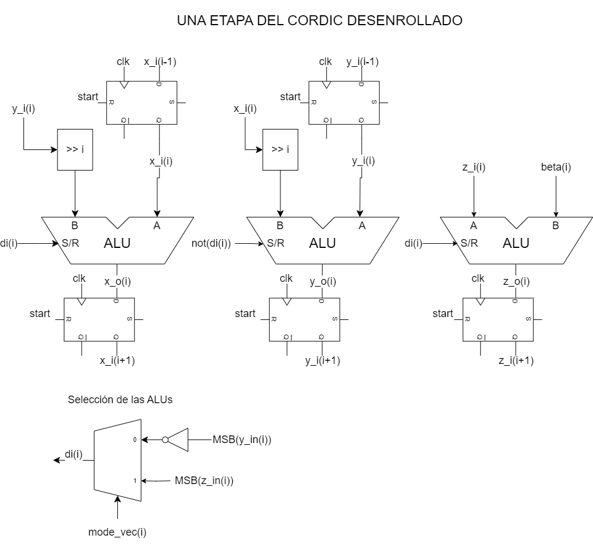
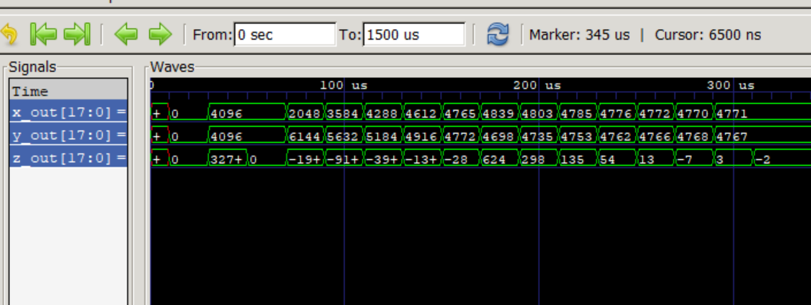
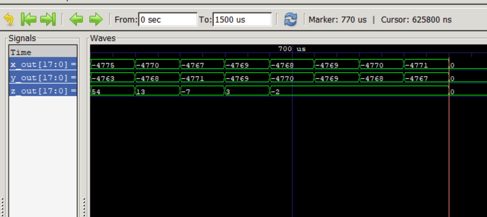
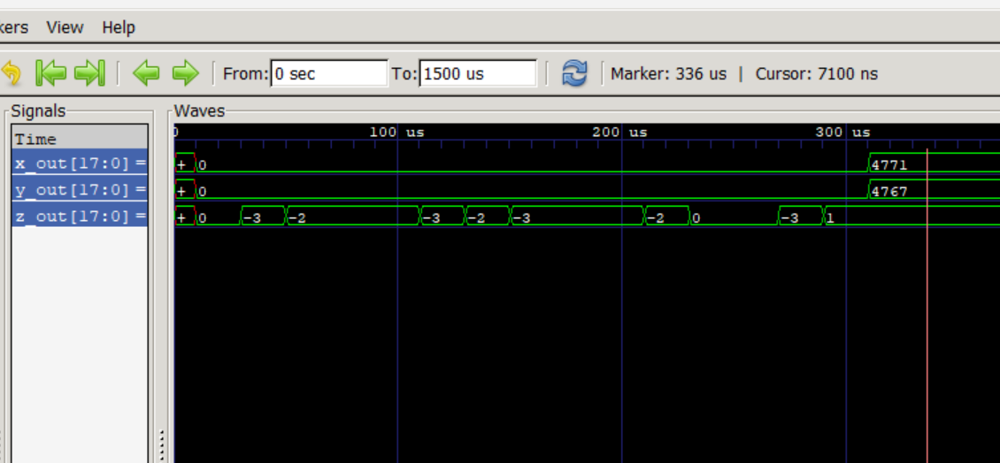
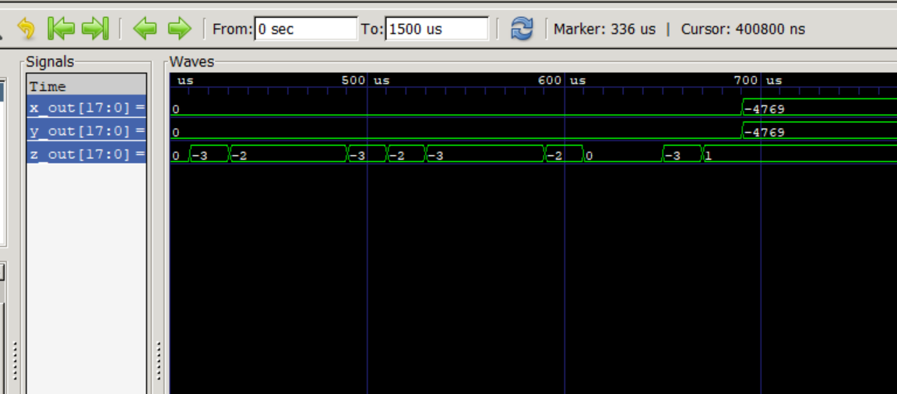

# Sistemas digitales - Trabajo práctico número 3
## CORDIC

Para compilación y simulación rápida ejecutar cordic.ps1 (solo para windows sirve).

### Arquitectura CORDIC enrollada

### Arquitectura CORDIC desenrollada
En la siguiente figura se muestra una etapa del cordic desenrrollado. Tener en cuenta que éste también cuenta con un precordic, cuyas salidas están conectadas a x_i(0), y_i(0) y z_i(0). Por otro lado, las salidas van a ser el último elemento de los vectores de tipo signed, es decir x_o(ITERATIONS), y_o(ITERATIONS) y z_o(ITERATIONS).

## Simulaciones

### Simulaciones arquitectura enrollada

#### Simluación componente solo en 'x' y ángulo a rotar 45°.

#### Simluación componente solo en 'y' y ángulo a rotar 135°.

### Simulaciones arquitectura desenrollada

#### Simluación componente solo en 'x' y ángulo a rotar 45°.

#### Simluación componente solo en 'y' y ángulo a rotar 135°.

