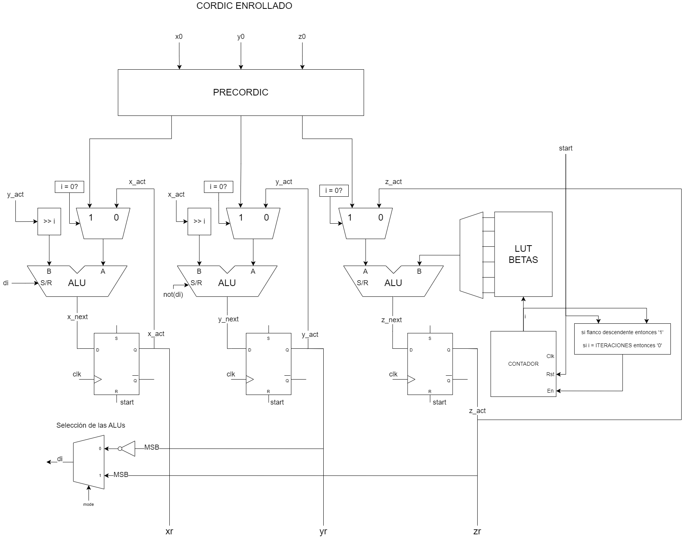

# Sistemas digitales - Trabajo práctico número Final

## Arquitectura de rotación de un vector en 2D, basada e nel algoritmo de CORDIC

### CORDIC

Para compilación y simulación rápida ejecutar cordic.bat (solo para windows sirve). Comentar/Descomentar testbenches que se quieran correr o no.

### Arquitecutra general

### Arquitectura CORDIC enrollada

### Resultados simulaciones

### Resultados pruebas en Vivado