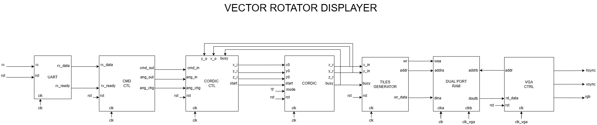
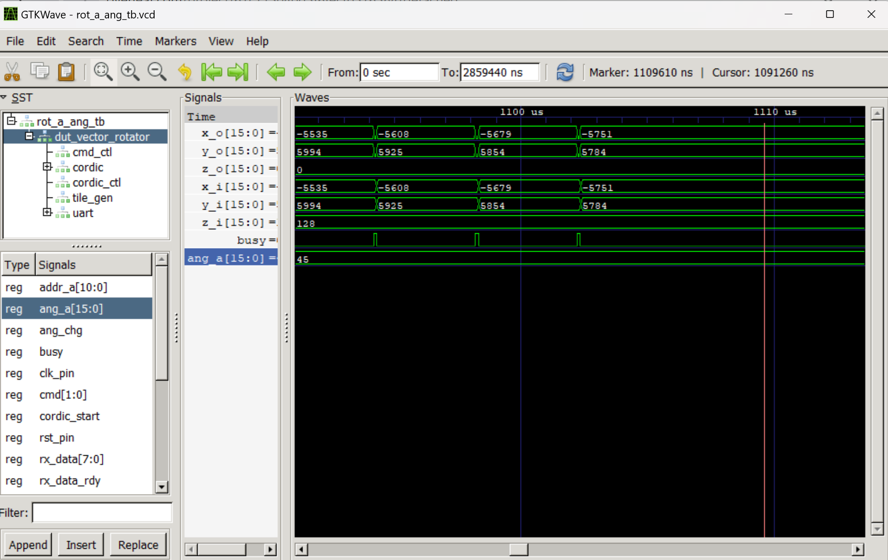
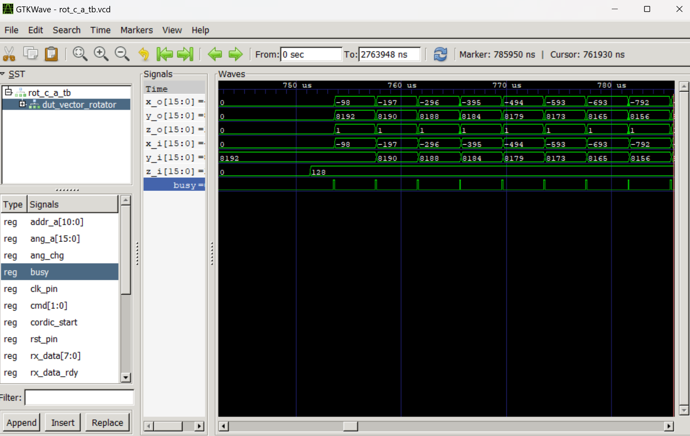
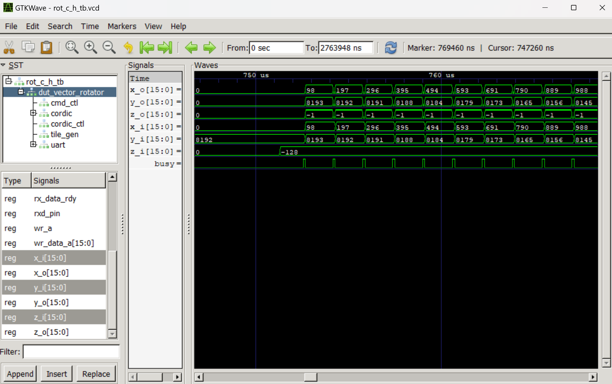
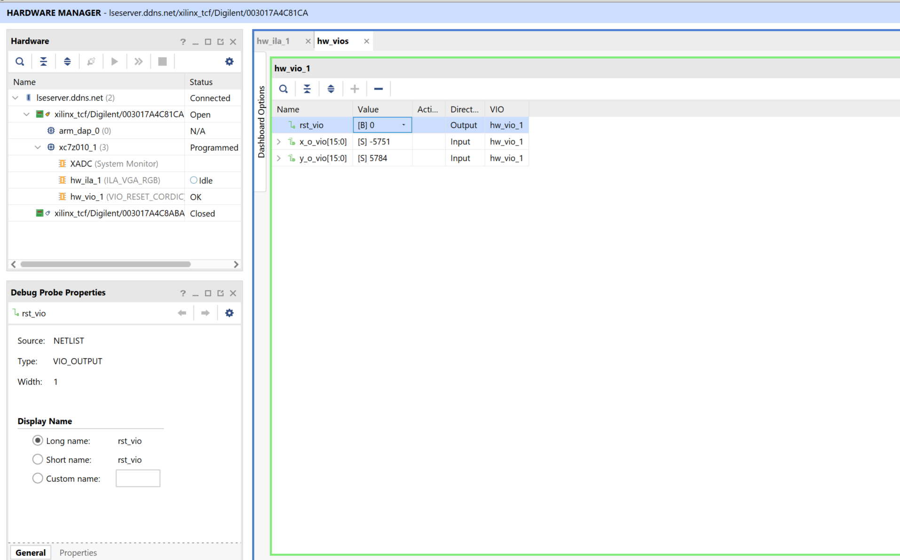
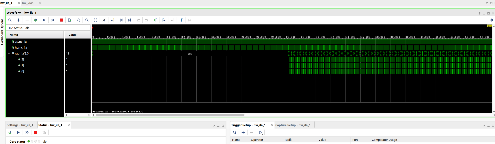
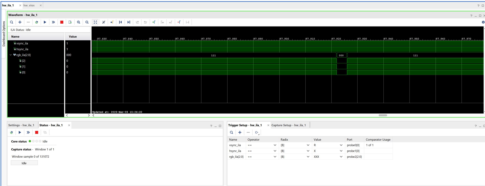

# Sistemas digitales - Trabajo práctico Final

## Arquitectura de rotación de un vector en 2D

Arquitectura de rotación de un vector en 2D, basada en el algoritmo de CORDIC. Recibe comandos por UART y los muestra en pantalla mediante VGA.

**Comandos:**
* ROT A ang
* ROT C A
* ROT C H

### Compilación de archivos y ejecución de simulaciones

Para compilación y simulación rápida ejecutar build.bat (solo para windows). Comentar/descomentar testbenches que se quieran correr o no.

### Arquitecutra general

### Arquitectura CORDIC enrollada

### Resultados simulaciones (sin VGA ni DUAL PORT RAM)

#### Simulación comando ROT A 45

#### Simulación comando ROT C A

#### Simulación comando ROT C H

### Resultados pruebas en Vivado (comando ROT A 45)

#### Mediciones en VIO de salidas del CORDIC

#### Medición Vertical Back Porch de señal de VGA con ILA

#### Meidición de tile = (-22;22) en señal VGA con ILA

